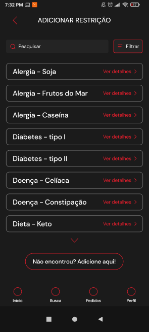

# ifood-hackathon

# PROJETO IFOOD

## TECNOLOGIAS
- FRONTEND
1) REACT NATIVE - FUNCIONALIDADE MOBILE(EM TODAS AS PLATAFORMAS); ESCALABILIDADE PARA WEBAPP COM REACT.

- BACKEND
1) BANCO DE DADOS POSTGRESSQL; TYPEORM
2) NODEJS - CONSTRUIR API; CONSTRUIR SERVIDOR COM EXPRESS;

- DEPLOY //SERVIÇO DE NUVEM //SERVIDOR
1) AWS
2) DOCKER 

## NOVAS FUNCIONALIDADES NO APP

Primeiramente, pensamos em fazer uma navegação fácil dentro do aplicativo, verificamos o problema e a falta de filtros em relação a refeições/produtos e com isso incluímos novas abas, facilitando a visualização e na hora de conclusão do pedido.

## Home 
 
Novas Ferramentas: Ilustração de como seria a apresentação da nova ABA dentro do aplicativo.

## Perfil
 
Novas Ferramentas: Restrição e meu cardápio.

## Meu cardápio
 
Novas Ferramentas: Lista com seus pratos/receitas.

## Restrições alimentares
 
Novas Ferramentas: Informações sobre restrições alimentares.

## Receitas
 
Novas Ferramentas: Patrocínio incluindo mini vídeos de receitas, informações e foto.

## Adicionar Refeição
 
Novas Ferramentas: Escolher refeição/produto.

## Adicionar restrição
 
Novas Ferramentas: Incluir restrição.

## Receita detalhada
 
Novas Ferramentas: Detalhamento sobre a receita.

